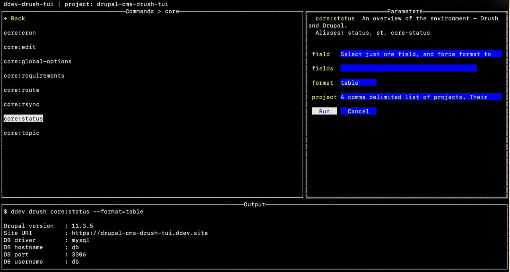

# ddev-drush-tui

A terminal UI for [Drush](https://www.drush.org/), running inside [DDEV](https://ddev.com/). Browse every available Drush command, fill in its parameters with guided prompts, and see the output — without memorising any syntax.



---

## Why

Drush has hundreds of commands. Even experienced Drupal developers forget the exact argument names and valid values. This tool lets you explore commands by namespace, see inline descriptions for every field, and run commands from a form — all without leaving the terminal.

---

## Requirements

- [DDEV](https://ddev.com/) v1.22+
- Drush installed in your DDEV project (standard Drupal projects have it automatically)
- macOS or Linux host

---

## Installation

Add the add-on to your DDEV project:

```bash
ddev add-on get cellear/ddev-drush-tui
```

Then launch it from anywhere inside your DDEV project directory:

```bash
ddev drush-tui
```

---

## Usage

The TUI has three panes.

**Commands (left)** — Browse commands grouped by namespace. The list starts at the namespace level with command counts. Press Enter to drill in, and `← Back` or Esc to go up.

**Parameters (right)** — When you select a command, the form shows every argument and option with descriptions as placeholder hints. Fields with a fixed set of valid values (like `--format` or `--type`) are rendered as dropdowns. Required fields are marked with `*`.

**Output (bottom)** — Shows the full output of the last command, scrollable with standard `less`-style keys.

### Keyboard reference

| Key | Action |
|-----|--------|
| Arrow Up / Down | Navigate the command list or scroll output |
| Enter | Drill into namespace / select command / submit form |
| Tab | Cycle focus: commands → parameters → output → commands |
| Esc | Back to namespace list / cancel form / leave output pane |
| `/` | Open search filter in command list |
| Space / `b` | Page down / page up in output pane |
| `g` / `G` | Jump to top / bottom of output |
| `q` | Quit (when command list is focused) |

### Running a command

1. Navigate to a namespace and press Enter
2. Select a command — the parameter form loads automatically
3. Fill in any fields (required ones are marked `*`; descriptions tell you what to type)
4. Press Tab to reach the Run button, then Enter — or navigate to Run with arrow keys
5. Output appears in the bottom pane

If a required field has no obvious value, pressing Run once shows a warning. Pressing Run a second time executes anyway, letting Drush use its own defaults or show its own error message.

---

## Building from source

```bash
git clone https://github.com/cellear/ddev-drush-tui
cd ddev-drush-tui
make build        # produces bin/ddev-drush-tui
make install      # copies binary into your DDEV project
```

Requires Go 1.25+.

---

## Stack

- [Go](https://go.dev/)
- [tview](https://github.com/rivo/tview) — terminal UI framework
- All Drush interaction via `ddev drush` — never calls Drush directly

---

## Status

Early-stage proof of concept. Sprints 1–4 complete:

- [x] Namespace drill-down command browser
- [x] Parameter forms with hints and dropdowns
- [x] Command execution with scrollable output
- [x] Search/filter (`/`)
- [x] Required-argument validation

Coming next: error handling, cross-platform builds, GitHub releases.
